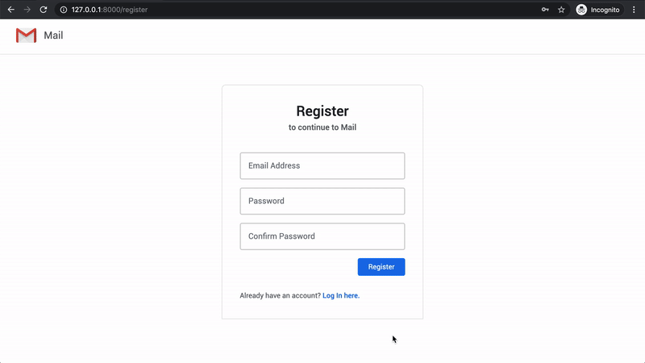
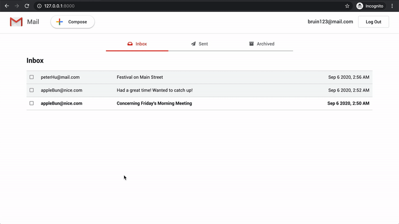
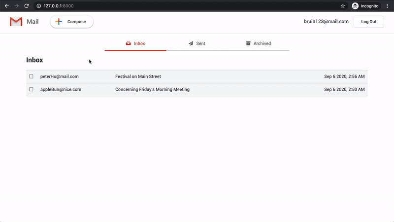
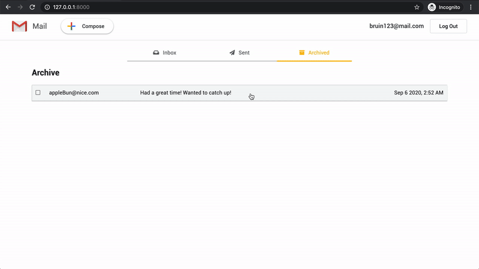

# Gmail
An email web application similar in design and function to Google's [Gmail](https://www.google.com/intl/en-GB/gmail/about/). Django is the main framework used for this project.

**Login and register**  

  **Email details**  

  **Compose email**  

  **Archive email**  

### Architecture
**Frontend**
- Languages: 
 	* JavaScript
	* HTML
	* CSS
- Main Framework/Libraries:
 	* [Django Templates](https://docs.djangoproject.com/en/3.1/ref/templates/language/)
	* [Bootstrap](https://getbootstrap.com/)

**Backend**
- Language: 
	* Python
- Main Framework/Libraries:
 	* [Django](https://www.djangoproject.com/)

**Database**
- [SQLite](https://www.sqlite.org/index.html)
